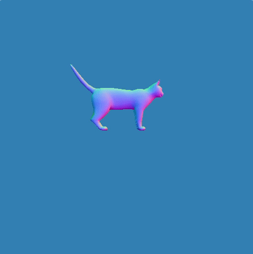
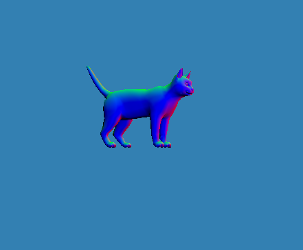
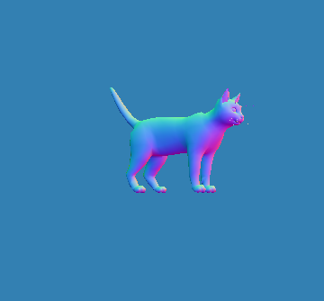

# Computer Graphics 🖥⚛️
> By Jeroen Overschie and Indy Roode

## 1. Shaders

### Normal shading

Normal shading using no matrix transformation:

Normal shading with matrix:

A clear difference in color is visible between the mapped color values in the fragment shader and the non-mapped values. Not mapped:

Color values mapped. No data is lost, colors are brighter.

### Selecting shaders
### Gouraud shaders
### Phong shader

## 2. Texture mapping