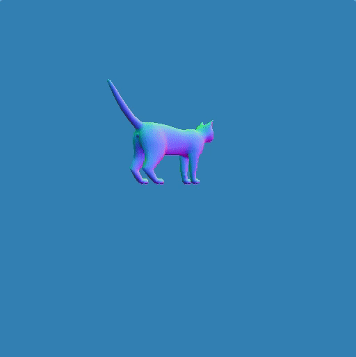

# ⚛️ Computer Graphics 🖥
> By Jeroen Overschie and Indy Roode

## 1. Shaders

### Normal shading

Normal shading using no matrix transformation. Visible is the fact that the colors don't adjust according to the newly rotated/transformed angles.



Normal shading with matrix:


A clear difference in color is visible between the mapped color values in the fragment shader and the non-mapped values. Not mapped:


Color values mapped. No data is lost, colors are brighter.


### Selecting shaders

Darkening color for Gouraud and Phong shader programs:


### Gouraud shader

Gouraud shading. Calculation in vertex shader.


### Phong shader

For the Phong shader, we are using exactly the same calculation as in Gouraud's shader, but then in the Fragment shader instead of the vertex shader. We pass on required variables on from the vertex to the Fragment shader, and other via an uniform variable.


## 2. Texture mapping

All steps were followed and the texture should successfully show up - but it unfortunately does not. My system required the `texture` method to be used instead of the `texture2D`, but it still does not show any sign of a texture.

I also played around with the different parameters. I set the parameters to:

```
GL_TEXTURE_WRAP_S = GL_REPEAT
GL_TEXTURE_WRAP_T = GL_REPEAT
GL_TEXTURE_MIN_FILTER, GL_NEAREST
GL_TEXTURE_MAG_FILTER, GL_NEAREST
```

That shouldn't cause a problem.


I suspect either (1) something might be wrong in passing the uniform `textureColor` (2) my system does not correctly handle the texture; I am running the latest MacOS.

The latest state of the code is the version with textures, in case it does work on a different system. ℹ️ To check out the working Gouraud and Phong shading without textures, please comment `fragshader_gouraud.glsl#24-27` and `fragshader_phong.glsl#42-45`.