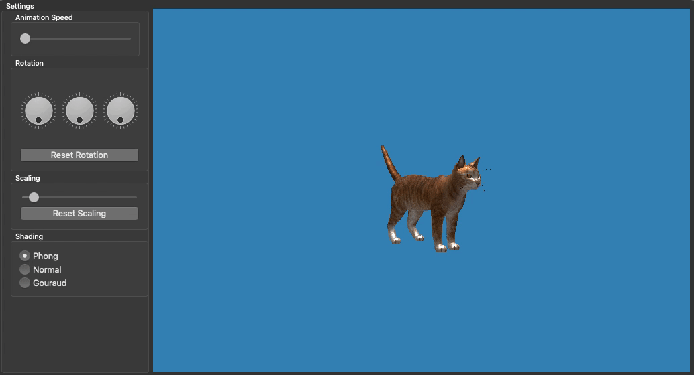

# ⚛️ OpenGL 3 🖥
> Computer Graphics by Jeroen Overschie. (Indy Roode dropped out)

## 1. Common animation
### Rotating a model

I created a slider in the UI to modify the number with which we modify the rotation in each repaint.

As an example we modify the `y` variable in `rotation` with a value in the range of `0.0` to `1.0`.

### Animating a complete scene

For the scene I decided to mimic a sort of 2D game (but then now obviously in 3D) where one would have to dodge incoming blocks / objects.

The cat is to be controlled by the mouse, which makes it jump up upon clicking. The movement is inspired by Flappy birds' movements.

In order to support multiple objects I created a struct called `ObjectInstance`, holding its current `VAO`, `VBO` and all positioning- and rotational data.

## 2. Advanced vertex manipulation: water shader

...