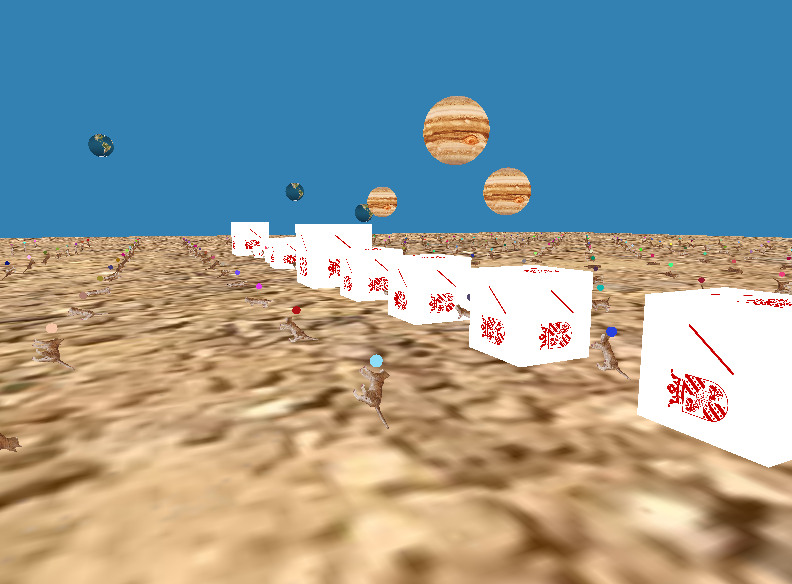
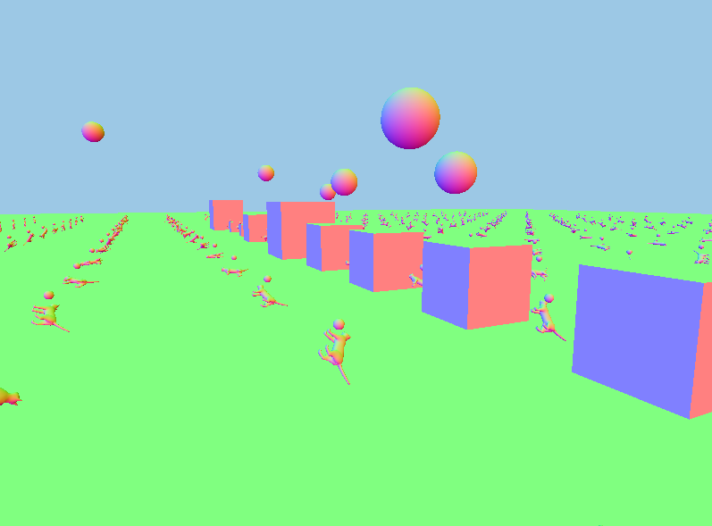
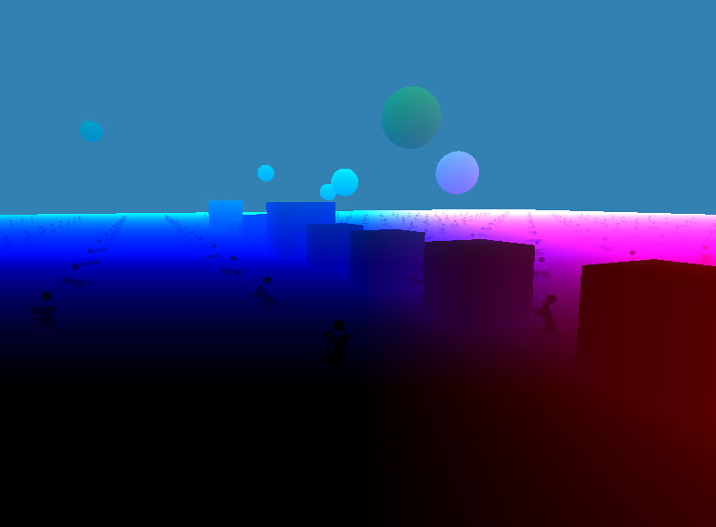
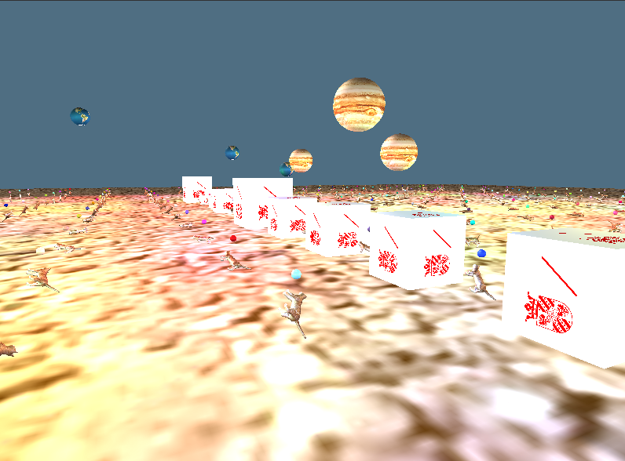

# Deferred Shading
> An additional assignment in the CG 2018-2019 programme

`[14-06-2019]`

## Usage

Program was tested on the RUG LWP Ubuntu computers.

## General
	
I began with the CG 18-19 OpenGL_3 startpoint code from Nestor and starting building on top of that. I first implemented some abstractions for easily rendering multiple meshes and textures, see the `Mesh` and `Object` classes. An object is an entity that is rendered on screen, which can have a texture and a mesh attached. A mesh is loaded using the `Model` class. Next, I also added a view transform in order to simulate a camera view. All rotational controls rotate the entire scene. 

## gBuffers

Upon intialization of the main view we first create a framebuffer object and then create all gBuffers required, storing them in a texture. We create gBuffers to store color, normals, position and depth. All this is done in the `FramebufferObjectInstance` class.

Instead of just using a `RGBA` type format for the textures, I decided to use a `RGA8` internalFormat for my color texture, and a `GL_RGBA16F` for my normals and position texture. For the depth texture we are (obviously) using a `GL_DEPTH_COMPONENT` format.

I created a little control panel in the UI for selecting a gBuffer to be rendered.

In this way, we can visualize all gBuffers.

Color texture:

Normals texture:

Position texture:

Depth texture:

We send all gBuffer textures by hooking a uniform for every texture. We allocate a separate texture location for every gBuffer, ranging from `GL_TEXTURE0` to `GL_TEXTURE3`. Upload performed in `FramebufferObjectInstance::updateShaderUniforms`.

→ Also, upon resizing, all gBuffer textures are correctly re-initialized using `glTexImage2D`.

## (Deferred) Rendering / Shading

### First pass
We first cycle through the rendering once, simply rendering the geometry without any lighting calculations. We bind the fbo before rendering thus rendering into our (non-default) fbo. I created a simple shader for simply rendering objects: `vertshader_geometry` and `fragshader_geometry`. We render all objects in this pass (in this case, a lot of cats).

We switch back to the normal fbo by binding `defaultFramebufferObject()`: 

`glBindFramebuffer(GL_DRAW_FRAMEBUFFER, defaultFramebufferObject);`

### Second pass
Lighting pass. I am using one shader which computes a directional (sun) light and light bulbs. In the shader, I initialize a zero-vector to represent (dark) color, and then accumulate the light as I go. I first compute the directional sunlight color, and then loop over all the lights (supplied by uniform arrays) and add that light to the color accumulation vector. The shader is called `vertshader_light.glsl` and `fragshader_light.glsl`.

We supply the light shader with 3 vertices without attributes and use this to render a quad. The vertex shader supplies the fragment coordinates to the fragment shader. In the fragment shader, we can then grab the data from the gBuffers, which have been filled in the first pass.

In order to now compute the lighting, we do then still need to compute, for every fragment, its original world location. We do this by supplying the inverse view-project matrix as a uniform to the shader on every frame. We take the fragment pixel location (map it back to -1 to 1 range), the depth value from the depth buffer (also map back to -1 to 1 range) and store the as a `vec3`. We then transform this vector by the inverse matrix, and lastly we undo the last transformation by dividing by the vector `xyz` components by its `w` component. We have now reconstructed the original vertex position from the fragment pixel location.

Now, since we simply have the vertex location again, we can use the same Phong illumation computations as we did previously. I edited the material components and added some attenuation, to decrease the light intensity the farther the light travels from the lightsource. The attenuation is of form `1/(a + bx + cx^2)` where `x` is distance.

***Sunlight (directional):***

***Lightbulbs (point lights):***
I added lots of different point light sources to best illustrate the benefit of deferred shading. A grid of light points are generated, hovering slightly above the cats. The colors are generated at random in the `lightpoint.cpp` class.

Using both light sources:

Lighting can be turned on or off individually using the UI.

#### Lightbulbs

For every light that is created, also a little sphere object is created. Every sphere does not get a texture, but gets an ambient color matching its light color instead. In the light-shader, when the distance of the vertex position to the light source is less than `< 0.2f`, we output the color of the lightbulb. Since we also size the lightbulbs `0.2f`, this means that some extra color is added to the lightbulb in the shading process. In this way, the light bulbs really seem to be turned 'on' or 'off', depending whether the lights are turned on or off.

A lightbulb hovering just above a cat. Visible are correct diffuse and specular lighting calculations.

### Scene

I drew a scene with a grid of cats on top of a large box, with some planets around it. Light sources hover above the cats. 20x20 grid:

Grid size if configurable in the `createObjects()` function in `mainview.cpp` by editing variables `w` and `h`.

### Animation

By pressing the animate checkbox the lightbulbs will hover up and down. This way, you can see the light interactions better as well test the performance.

### Performance

Pressing the `run performance test` button will rotate the screen and measure average FPS. Test will last 30 seconds or can be stopped earlier by pressing the button.

Performance test in progress.

When test is stopped the average fps is printed onto the console.

### Controls

You can use the mousewheel to scale (zoom in and out).

### About

By Jeroen Overschie, Computing Science student at RUG.
