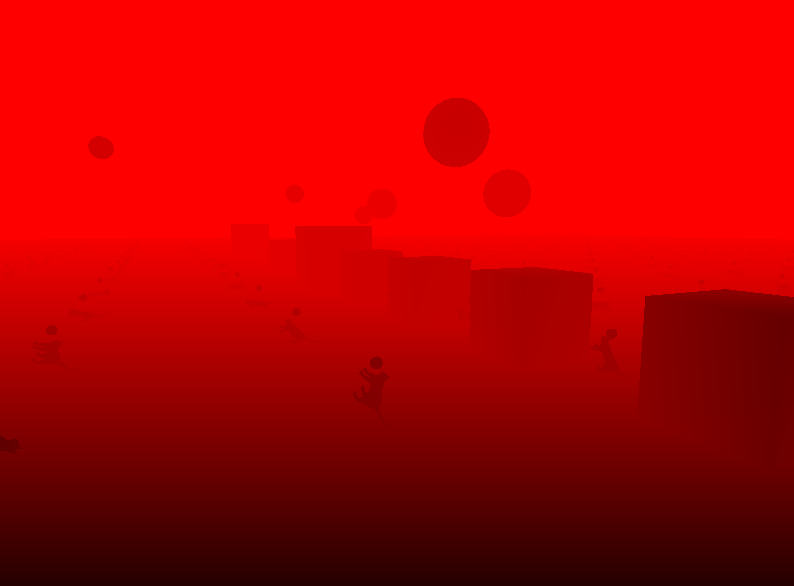
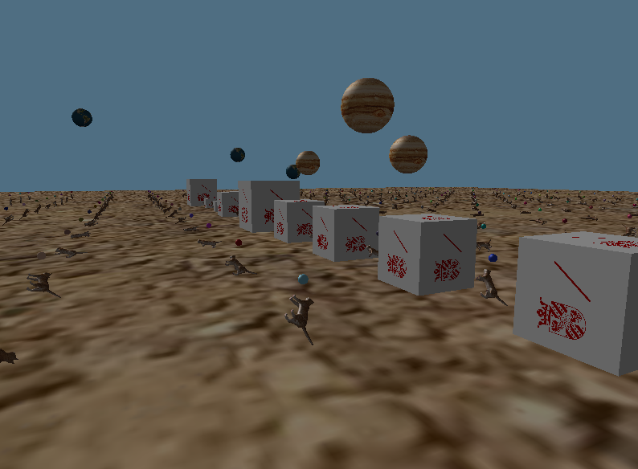

# Deferred Shading
> An additional assignment in the CG 2018-2019 programme

## Usage

Program was tested on the RUG LWP Ubuntu computers.

## General
	
I began with the CG 18-19 OpenGL_3 startpoint code from Nestor and starting building on top of that. I first implemented some abstractions for easily rendering multiple meshes and textures, see the `Mesh` and `Object` classes. An object is an entity that is rendered on screen, which can have a texture and a mesh attached. A mesh is loaded using the `Model` class. Next, I also added a view transform in order to simulate a camera view. All rotational controls rotate the entire scene. 

## gBuffers

Upon intialization of the main view we first create a framebuffer object and then create all gBuffers required, storing them in a texture. We create gBuffers to store color, normals, position and depth. All this is done in the `FramebufferObjectInstance` class.

Instead of just using a `RGBA` type format for the textures, I decided to use a `RGA8` internalFormat for my color texture, and a `GL_RGBA16F` for my normals and position texture. For the depth texture we are (obviously) using a `GL_DEPTH_COMPONENT` format.

I created a little control panel in the UI for selecting a gBuffer to be rendered.

In this way, we can visualize all gBuffers.

Color texture:

Normals texture:

→ Individual objects have their normal transformed by a `meshNormalTransform` uniform matrix. Normals are correctly drawn when objects are individually rotated:

Position texture:

Depth texture:

We send all gBuffer textures by hooking a uniform for every texture. We allocate a separate texture location for every gBuffer, ranging from `GL_TEXTURE0` to `GL_TEXTURE3`. Upload performed in `FramebufferObjectInstance::updateShaderUniforms`.

→ Also, upon resizing, all gBuffer textures are correctly re-initialized using `glTexImage2D`.

## (Deferred) Rendering / Shading

### First pass
We first cycle through the rendering once, simply rendering the geometry without any lighting calculations. We bind the fbo before rendering thus rendering into our (non-default) fbo. I created a simple shader for simply rendering objects: `vertshader_geometry` and `fragshader_geometry`. We render all objects in this pass (in this case, a lot of cats).

We switch back to the normal fbo by binding `defaultFramebufferObject()`: 

`glBindFramebuffer(GL_DRAW_FRAMEBUFFER, defaultFramebufferObject);`

### Second pass
Lighting pass. We are using two separate shaders for lighting. I have one shader which computes a directional light, simulating sunlight, appropriately calling the shader `vertshader_light_sun` and `fragshader_light_sun`. As you can see light falls on the models from a specific direction:

The second shader computes light from a point light source. I added lots of different point light sources to best illustrate the benefit of deferred shading. A grid of 20 by 20 (=400) light points are generated, hovering slightly above the cats. The colors are generated at random in the `lightpoint.cpp` class. This type of shading looks as follows:

Using both shaders:

Both shaders can be turned on or off individually using the UI.

### Performance

Pressing the `run performance test` button will rotate the screen and measure average FPS. Test will last 30 seconds or can be stopped earlier by pressing the button.

When test is stopped the average fps is printed onto the console.

The test will update rotation on every frame, so slow performance means slow rotation, whilst fast performance will rotate the screen faster.

### Controls

You can use the mousewheel to scale (zoom in and out).

### About

By Jeroen Overschie, Computing Science student at RUG.
