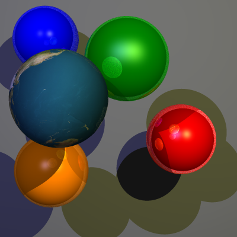

# Raytracer 2

> By Jeroen Overschie and Indy Roode

All exercises are implemented.

### Optical Laws

Using shadow.

`scene01-shadows.png`

`scene01-lights-shadows.png`

`scene01-reflect-lights-shadows.png`

### Anti-Aliasing

Super sampling.

`scene01-ss.png`

### Textures

Using the provided `earthmap1k.png` image.

`scene01-texture-ss-reflect-lights-shadows.png`

